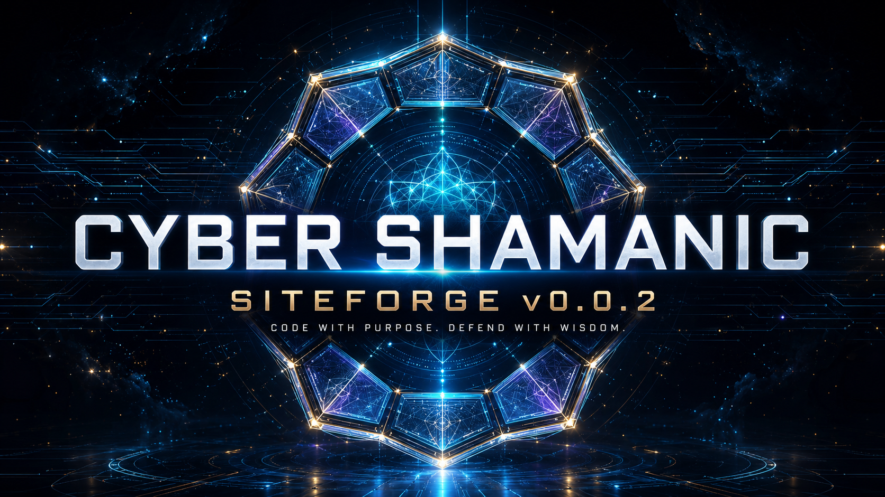

<div align="center">



# ⚡ Cyber Shamanic — SiteForge

### Cybersecurity • AI • Automation • OSINT • Cloud • Open Source • Visual Systems

**Version 0.0.2 · Static multi-page website · Hebrew RTL**

[Website](index.html) · [Services](services.html) · [Pricing](pricing.html) · [Projects](projects.html) · [Order Form](order.html)

</div>

---

## 🧭 About

SiteForge is the static, portable website package for **Cyber Shamanic**. It combines a cinematic cyber-spiritual visual identity with a structured services catalog, starting prices, a selectable order form, and a WhatsApp handoff.

The package uses plain HTML, CSS, and JavaScript. It can run locally by opening `index.html`, or be hosted on GitHub Pages and any static web host.

## 📁 Structure

```text
site-v0.0.2/
├── index.html
├── about.html
├── services.html
├── pricing.html
├── projects.html
├── order.html
├── README.md
├── CHANGELOG.md
├── CREDITS.md
├── assets/
│   ├── icons/
│   │   └── favicon.ico
│   └── images/
│       ├── cyber-shamanic-logo.png
│       ├── hero-cyber-core.png
│       ├── hero-network.png
│       └── readme-cover.png
├── functions/
│   ├── navigation.js
│   ├── order-form.js
│   ├── pricing-calculator.js
│   └── ui.js
└── styles/
    └── main.css
```

## 🧩 Main capabilities

- Six separate HTML pages.
- Responsive navigation and mobile menu.
- Original Cyber Shamanic logo and favicon.
- Two cinematic Hero images.
- Dedicated README cover.
- Service catalog organized by category.
- Starting-price packages and interactive estimator.
- Order form with checkboxes, client details, budget, timeline, and live summary.
- WhatsApp message generator with all selected services and price estimate.
- No build process or external JavaScript dependency.
- Hebrew RTL layout with English brand language.

## 📲 WhatsApp flow

The form never stores customer information. On submit, `functions/order-form.js` builds a formatted message and opens:

```text
https://wa.me/972535366687
```

The visitor reviews the prepared text and chooses whether to send it.

## 💰 Pricing

Prices are starting estimates in Israeli shekels. The final quote is determined after scope, complexity, schedule, security, and deliverables are defined.

## 🚀 Run locally

1. Extract the ZIP.
2. Open `index.html` in a modern browser.
3. Navigate between pages normally.

For a local HTTP server:

```bash
python3 -m http.server 8080
```

Then open `http://localhost:8080`.

## 🌐 GitHub Pages

Upload the package contents to the root of a repository and enable GitHub Pages from the default branch. Keep `index.html` at the repository root.

## 🔗 Contact

- GitHub: [Cyber-Shamanic](https://github.com/Cyber-Shamanic)
- Email: [cybershamanic@gmail.com](mailto:cybershamanic@gmail.com)
- WhatsApp: [+972 53-536-6687](https://wa.me/972535366687)

## 📅 Release

- Gregorian: 24 July 2026
- Hebrew: י׳ באב ה׳תשפ״ו
- Version: `0.0.2`
- Visual depth system: `33 layers`

> ״נֵר לְרַגְלִי דְבָרֶךָ, וְאוֹר לִנְתִיבָתִי.״ — תהילים קי״ט, ק״ה
